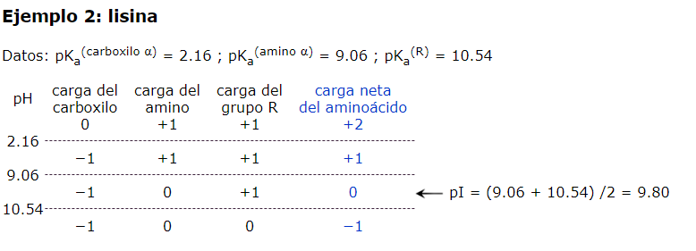

# Práctica 8: PuntoIsoelectrico

## Descripción

En esta práctica utilizaremos como base el código de la práctica anterior [Practica7_CargaElectrica](https://github.com/ulises1229/ComputacionI-2021-1/tree/master/practicas/7_CargaElectrica). Es posible calcular la carga neta de una molécula a un cierto pH, esto resulta de utilidad para el cálculo de su punto isoeléctrico (generalmente denotado por _pI_). Este valor es aquel pH en el cual la molécula tiene una carga neutra, es decir carga cero. Puedes consultar más sobre el punto isoeléctrico en [este sitio](http://www.ehu.eus/biomoleculas/buffers/buffer3.htm) y si quieres consultar ejemplos e incluso ejercicios puedes ver [este otro sitio](http://biomodel.uah.es/tecnicas/carga/calculo_pI.htm).

De nueva cuenta hemos puesto a tu disposición [el siguiente código](PuntoIsoelectrico.cpp) con el esquema principal de esta práctica. En él, la función _main()_ realiza lo siguiente:
* Importa las librerías necesarias, así como las dos clases que vas a implementar.
* Pide al usuario el nombre de la molécula `nombreMolecula` y el número de grupos `numGrupos` con los que cuenta esta molécula.
* Crea e inicializa el número `numGrupos` de instancias del tipo `Grupo` con los datos ingresados por el usuario y los agrega molécula.
* Evalúa el punto isoeléctrico de la molécula y lo imprime en pantalla.

Este código cuenta con una única función la cual ya está implementada y que estuvo presente en la práctica pasada también:

`CrearGrupo` es una función que recibe como parámetro un número entero que representa el grupo que se está pidiendo al usuario. El objetivo de esta función es solicitar al usuario información respecto al grupo tal como su nombre (e.g. _carboxilo_, _amino_, etc.), así como el valor de su respectivo _pKa_ y su carga eléctrica con un pH mayor a su pKa. Posteriormente crea una instancia de la clase `Grupo` pasando como argumentos al **constructor** el nombre, pKa y carga indicados por el usuario, regresando la nueva instancia creada. La declaración de la función es la siguiente: `Grupo CrearGrupo(int i)` donde `i` es el índice del grupo a llenar. Esta función **ya está totalmente implementada para tí**.

## Implementación

Para lograr tu práctica necesitarás crear e implementar las clases `Grupo` (declarando la estructura en un archivo `Grupo.h` y la respectiva implementación de sus métodos en `Grupo.cpp`) y de forma similar para una clase `Molecula`. Podrás crear tantos métodos y atributos como consideres necesarios en cada una de estas clases para lograr la implementación de la práctica.

En particular, podrás notar que estas clases deberán de contar con unos requisitos básicos: en el caso de la clase `Grupo` es necesario que cuente con un **constructor** que reciba el _nombre del grupo_ con una variable del tipo `string`, su _pka_ del tipo `foat` y su _carga eléctrica_ a un pH mayor a su pka(variable del tipo `int`).

De igual forma, la clase `Molecula` deberá de contar con dos caracterítsicas: un **constructor** que reciba como parámetros una variable del tipo `string` con el nombre de la molécula. También deberá de contar con un **método** denominado `AgregarGrupo` que reciba como parámetro una instancia de la clase `Grupo` y la guarde en algún atributo de la molécula, y otro método `CalcularPuntoIsoelectrico` que no recibe parámetros y regresa el valor del pI de la molécula con una variable del tipo `float`.

#### NOTA A CONSIDERAR
Para que tu práctica funcione de manera correcta, necesitarás cinco archivos, los ya mencionados para las clases `Grupo` y `Molecula` que son los que vas a implementar, y un quinto archivo que será el que te brindamos `PuntoIsoelectrico.cpp` en el cual se tiene toda la estructura del proyecto. Estos cinco archivos tendrán que encontrarse en tu carpeta para que todo funcione de la forma correcta en tu computadora.

### Ejemplo de funcionamiento
A continuación se muestra un ejemplo del funcionamiento esperado de tu práctica.

```
$ ./ PuntoIsoelectrico

Nombre de la molecula: Lisina
Numero de grupos: 3
Nombre grupo 0: Carboxilo
pK de Carboxilo: 2.16
Carga de Carboxilo a pH mayor a 2.16: -1
Nombre grupo 1: Amino
pK de Amino: 9.06
Carga de Amino a pH mayor a 9.06: 0
Nombre grupo 2: R
pK de R: 10.54
Carga de R a pH mayor a 10.54: 0
El punto isoelectrico de Lisina es = 9.8

```

Este problema deriva de los resultados del siguiente ejemplo:




Tomado de la [siguiente referencia](http://biomodel.uah.es/tecnicas/carga/calculo_pI.htm)
